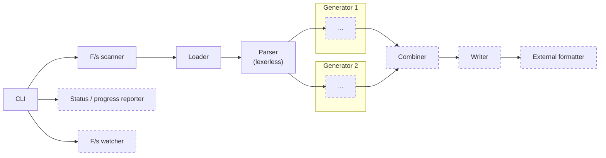

# Dart repointer

Dart repointer (`reptr`) ~~puts the sharp part in your Dart~~ aims to facilitate _fast_ code generation for Dart. It consists of [the tool itself](reptr/) and a [Dart parser library](dart-parser). This is predominantly due to inefficiencies in the code generation "infrastructure", the `build_runner`. A faster implementation should allow 20–50x speed-up.

## Motivation

`build_runner`-based code generation for a single package can take a couple minutes. This translates to unreasonably long code generation time for a large Dart or Flutter project (e.g. over 45 minutes 🤯). We can do better.

## Project structure

The key components of this project that are already functional are:

- Filesystem scanner
  - Identifies Dart packages and source files on the filesystem
- File loader
  - Loads a file into memory, performs UTF-8 validation
- Parser (lexerless)
  - Constructs an abstract syntax tree from the loaded Dart code

## Design notes

- Loading source files
  - Loading the complete file for parsing is fine
  - Memory-mapping is not faster per se
    - May play nicely with a lazy tokenizer with lazy UTF-8 validation
- Parsing
  - The parser is a _partial_ parser: it recognizes certain parts of the target language and can skip over the rest
  - Capturing slices of the source (`&str`) is extremely cheap (doesn't cause memory allocation), so take advantage of that
  - When feasible, avoid memory allocation (namely, the use of `Vec` and co.)
  - When implementing a parser as a function
    - Do not start parsing with whitespace
      - E.g. the import-stmt. parser should start with consuming `import`, not whitespace
    - Do not consume the trailing whitespace after a construct (e.g. in `import 'dart:math';\n\n` do not consume `\n\n`)
  - When combining parsers
    - Prefer consuming whitespace in trailing position, not leading
- A tempting feature: in-place code generation / code transformation
  - Requires accurate back-to-source transformation
- Output formatting
  - Delegate to [dart format](https://dart.dev/tools/dart-format) (it's fast enough)
